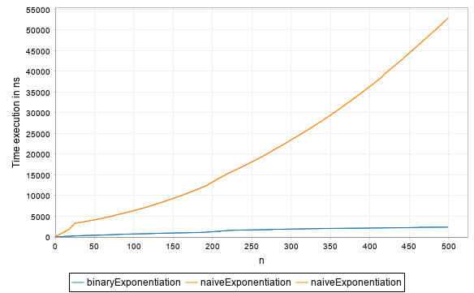

# Scalacmp

A light tool to visualize and compare the execution time of Scala functions.

## Installation

Clone this repo, and run `sbt publishLocal` to install it locally.

Then add the dependancies to your SBT project (e.g. `libraryDependencies += "com.warisradji" %% "scalacmp" % "0.1"` in build.sbt)

## Usage 

```scala
import com.warisradji.scalacmp.FunctionComparator

object Test extends App {
  def naiveExponentiation(x: Long, n: Long): Long = {
    var res = 1L
    var myN = n
    
    while(myN > 0) {
      res = res * x
      myN = myN - 1
    }
    res
  }

  def binaryExponentiation(x: Long, n: Long): Long = {
    if (n == 0)
      1
    else {
      val tmp = binaryExponentiation(x, n/2)
      if (n % 2 == 0)
        tmp * tmp
      else
        tmp * tmp * x
    }
  }

  FunctionComparator(
    List((binaryExponentiation _).tupled, (naiveExponentiation _).tupled), // List of functions to compare (the functions should be tupled or unary)
    (10L, 1L), // The initial value of the parameter pass to the functions
    (p: (Long, Long)) => (p._1, p._2 + 100), // Function to change the state of the parameter
    50 // Number of warmups to avoid pitfalls on the JVM
  ).plot(
    500, // Number of times the time must be calculated
    List("binaryExponentiation", "naiveExponentiation"), // Labels of the lines in the plot
    500, // Intensity of the FIR filter to smooth the generated curves
    Some("example.png") // Path of the file to save the plot
  )
}
```

Refer to the source code for more details on the functions. Here is the output: 



## Contributing

Pull requests are welcome. This is a small tool that I use personally, but feel free to improve it or add features.

## License

[MIT](https://choosealicense.com/licenses/mit/)